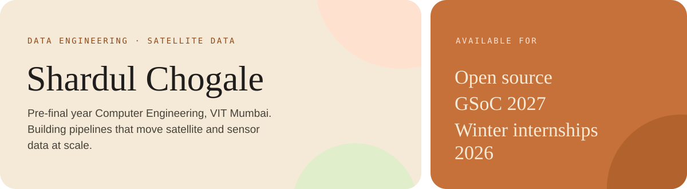
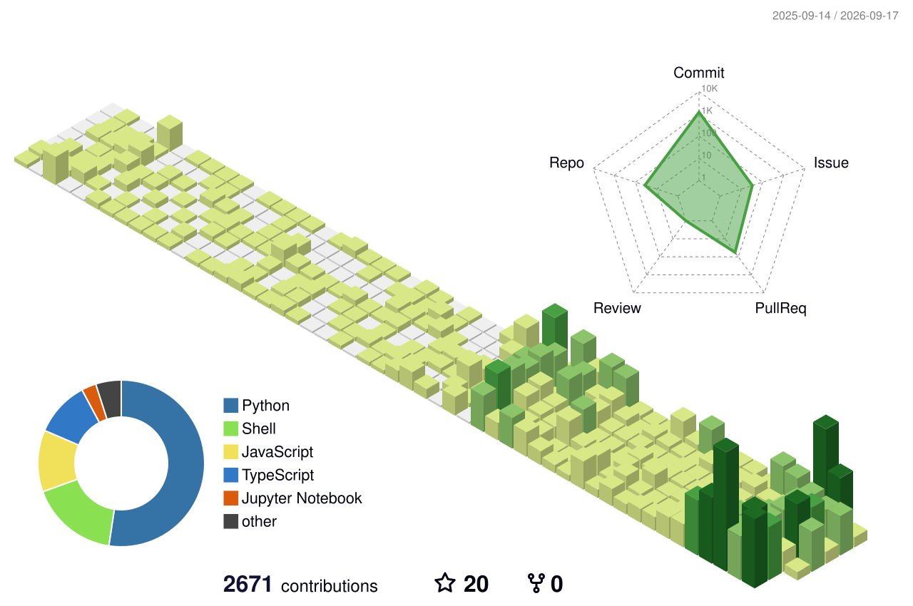

<!-- ═══════════════════════════════════════════════════════════════════════
     shard-c6 — GitHub profile README
     Layout: "Full dossier". Palette: Organic (terracotta #c67139 / sage #7a8a5e
     on cream #f5ead8). Previous versions kept in Older_versions/.
     ═══════════════════════════════════════════════════════════════════════ -->

  

  
  
  

  
  
  
  
  

  

## About me

<table>
  <tr>
    <td valign="top" width="36%">
      
    </td>
    <td valign="top" width="64%">
      <ul>
        <li><b>Building</b> — EVNet Sentinel · GreenGuard · dehelpers · PaperTrail</li>
        <li><b>Daily grind</b> — LeetCode streak · DSA · GATE DA prep</li>
        <li><b>Superpower</b> — satellite data processing and scalable data flow architecture</li>
        <li><b>Learning</b> — Apache Kafka · Spark · advanced SQL · AI/ML for data engineering</li>
        <li><b>Dream role</b> — AI Data Engineer, then Data Architect</li>
        <li><b>Cert path</b> — Databricks Associate DE · Spark Developer · AZ-900 · DP-900</li>
        <li><b>Status</b> — pre-final year Computer Engineering @ VIT Mumbai</li>
      </ul>
    </td>
  </tr>
</table>

## Featured work

<!-- Replace the descriptions below with your own one-liners. -->

| Project                                           | What it does                                           |
| :------------------------------------------------ | :----------------------------------------------------- |
| **[EVNet Sentinel](https://github.com/shard-c6)** | Monitoring pipeline for EV charging network telemetry. |
| **[GreenGuard](https://github.com/shard-c6)**     | Environmental monitoring from satellite imagery.       |
| **[PaperTrail](https://github.com/shard-c6)**     | Document understanding with OCR and AI/ML.             |
| **[dehelpers](https://github.com/shard-c6)**      | Utility library for everyday data engineering chores.  |

## Tech arsenal

  

  

  

  

  

  
  
  
  
  
  
  
  
  

## GitHub stats

  <table>
    <tr>
      <td>
        
      </td>
      <td>
        
      </td>
    </tr>
  </table>

  

## LeetCode grind

  

> Solving DSA daily as part of GATE DA prep.

## Contribution activity

  

  
  
  

## 3D contribution skyline

<!--
  Generated daily by .github/workflows/3d-contrib.yml
  First run: Actions → GitHub Profile 3D Contrib → Run workflow
-->

  <picture>
    <source media="(prefers-color-scheme: dark)" srcset="./profile-3d-contrib/profile-night-green.svg" />
    <source media="(prefers-color-scheme: light)" srcset="./profile-3d-contrib/profile-green.svg" />
    
  </picture>

## Metrics dashboard

<!--
  Generated daily by .github/workflows/metrics.yml (needs the METRICS_TOKEN secret).
-->

  

## GitHub summary

  
  
  

## Snake

<!--
  Generated by .github/workflows/snake.yml onto the 'output' branch.
-->

  <picture>
    <source media="(prefers-color-scheme: dark)" srcset="https://raw.githubusercontent.com/shard-c6/shard-c6/output/github-contribution-grid-snake-dark.svg" />
    <source media="(prefers-color-scheme: light)" srcset="https://raw.githubusercontent.com/shard-c6/shard-c6/output/github-contribution-grid-snake.svg" />
    
  </picture>

## Tech constellation

> Every skill is a star. Every project is a sun.

  

## Dev quotes terminal

  

  

