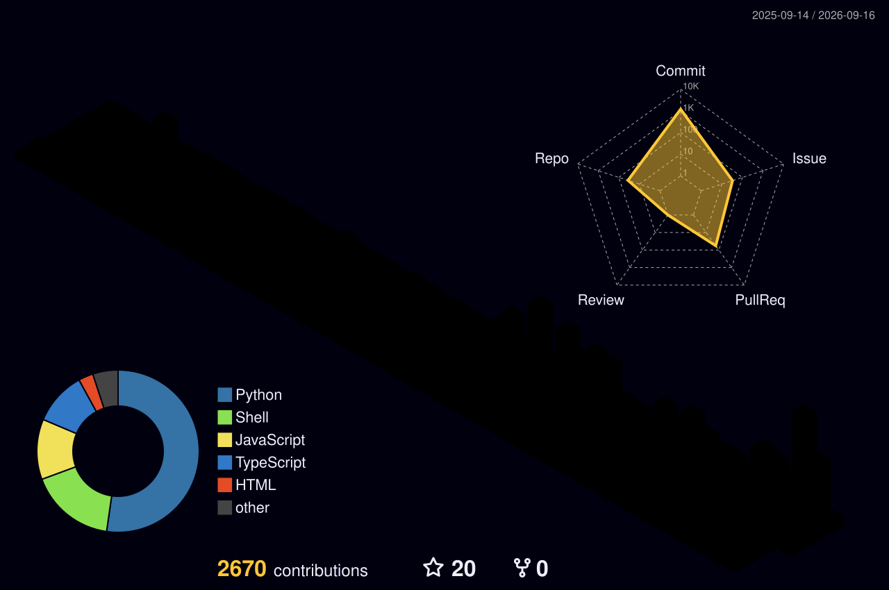

<!-- ═══════════════════════════════════════════════════════════════════════
     🔥 SHARD-C6 — GitHub Profile README
     Backed up original → README_old.md
     ═══════════════════════════════════════════════════════════════════════ -->

<!-- ┌──────────────── 🧠 NEURAL NETWORK HEADER ────────────────┐ -->

  

<h1 align="center">Shardul Chogale</h1>
<h3 align="center">AI Data Engineer | Satellite Data Wizard | GATE DA Aspirant</h3>

<!-- ┌──────────────── ⌨️ TYPING SVG ────────────────┐ -->

  

<!-- ┌──────────────── 👀 VISITOR COUNTER ────────────────┐
-->

  
  
  

<!-- ┌──────────────── 🌐 CONNECT WITH ME ────────────────┐ -->

  
  
  
  
  

---

<!-- ┌──────────────── 📖 ABOUT ME ────────────────┐ -->

##  About Me

- 🔭 **Building:** [EVNet Sentinel](https://github.com/shard-c6) · GreenGuard · dehelpers · PaperTrail (OCR/AI/ML)
- 🎯 **Daily Grind:** LeetCode streak 🔥 + DSA + GATE DA prep
- 🛰️ **Superpower:** Processing satellite data & scalable data flow architecture
- 🧠 **Learning:** Apache Kafka · Spark · Advanced SQL · AI/ML for Data Engineering
- 🏗️ **Dream Role:** AI Data Engineer @ Databricks → Data Architect
- 📜 **Cert Path:** Databricks Associate DE · Spark Developer · AZ-900 · DP-900
- 🎓 **Status:** Pre-final year Computer Engineering @ VIT Mumbai
- ⚡ **Hot Take:** Python >> Java _(and I will die on this hill)_ 🐍

 

---

<!-- ┌──────────────── 🛠️ TECH STACK ────────────────┐ -->

## 🛠️ Tech Arsenal

  

  

  

  

  

  
  
  
  
  
  
  
  
  
  

---

<!-- ┌──────────────── 📊 GITHUB STATS ────────────────┐ -->

## 📊 GitHub Stats

  <table>
    <tr>
      <td>
        
      </td>
      <td>
        
      </td>
    </tr>
  </table>

  

---

<!-- ┌──────────────── 📈 ACTIVITY GRAPH ────────────────┐ -->

## 📈 Contribution Activity

  

---

<!-- ┌──────────────── 🏙️ 3D CONTRIBUTION SKYLINE ────────────────┐ -->

## 🏙️ 3D Contribution Skyline

<!--
  ⚡ This section requires the GitHub Action in .github/workflows/3d-contrib.yml
  Run it manually the first time: Actions → GitHub Profile 3D Contrib → Run workflow
  The SVG will be auto-generated at profile-3d-contrib/profile-night-rainbow.svg
-->

  <picture>
    <source media="(prefers-color-scheme: dark)" srcset="./profile-3d-contrib/profile-night-rainbow.svg" />
    <source media="(prefers-color-scheme: light)" srcset="./profile-3d-contrib/profile-green-animate.svg" />
    
  </picture>

> 🔮 _This isometric skyline is auto-generated daily via [GitHub Actions](https://github.com/yoshi389111/github-profile-3d-contrib) — each bar represents a day of commits!_

---

<!-- ┌──────────────── 🏆 TROPHIES ────────────────┐ -->

## 🏆 GitHub Trophies

  

---

<!-- ┌──────────────── 🐍 SNAKE ANIMATION ────────────────┐ -->

## 🐍 Watch the Snake Devour My Contributions

<!--
  ⚡ This section requires the GitHub Action in .github/workflows/snake.yml
  Run it manually the first time: Actions → Generate Snake Animation → Run workflow
  The SVG will be auto-generated on the 'output' branch
-->

  <picture>
    <source media="(prefers-color-scheme: dark)" srcset="https://raw.githubusercontent.com/shard-c6/shard-c6/output/github-contribution-grid-snake-dark.svg" />
    <source media="(prefers-color-scheme: light)" srcset="https://raw.githubusercontent.com/shard-c6/shard-c6/output/github-contribution-grid-snake.svg" />
    
  </picture>

---

<!-- ┌──────────────── ✍️ RANDOM DEV QUOTE ────────────────┐ -->

## ✍️ Random Dev Quote

  

---

<!-- ┌──────────────── ⚡ FUN STATS ────────────────┐ -->

⚡ Fun Stats & Metrics

 

  

<!--
  Add more pinned repos here as you build them:
  
-->

---

<!-- ┌──────────────── 🧠 NEURAL NETWORK FOOTER ────────────────┐ -->

  

  <i>⭐ From <a href="https://github.com/shard-c6">shard-c6</a> — "Data is the new oil, but only if you know how to refine it." 🛢️</i>

